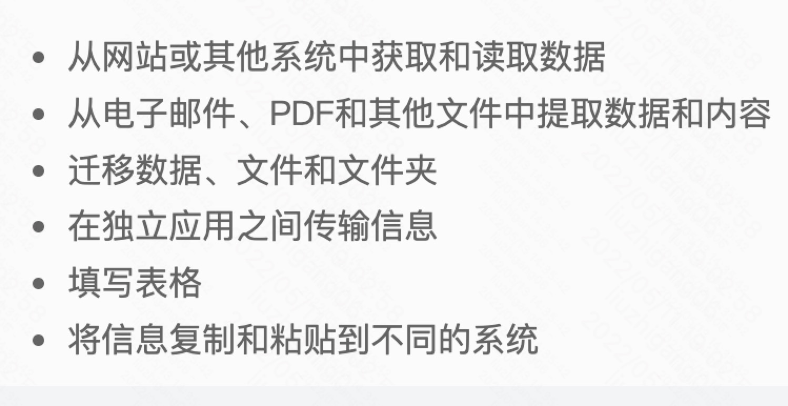
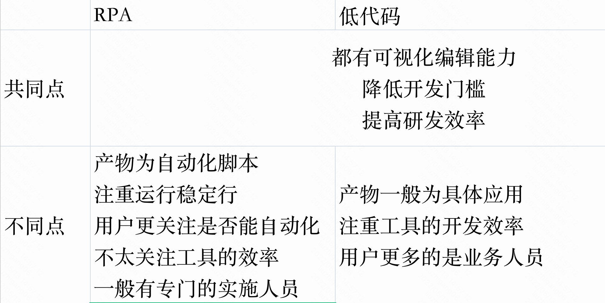
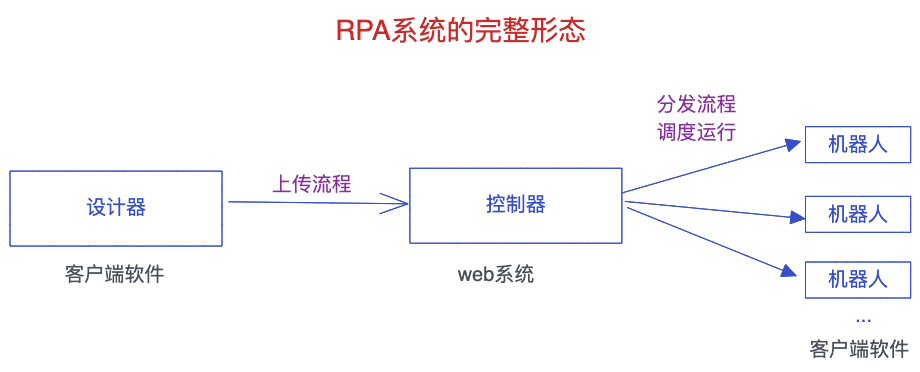
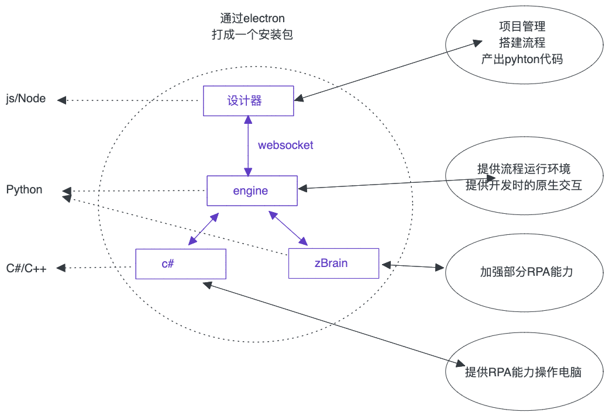
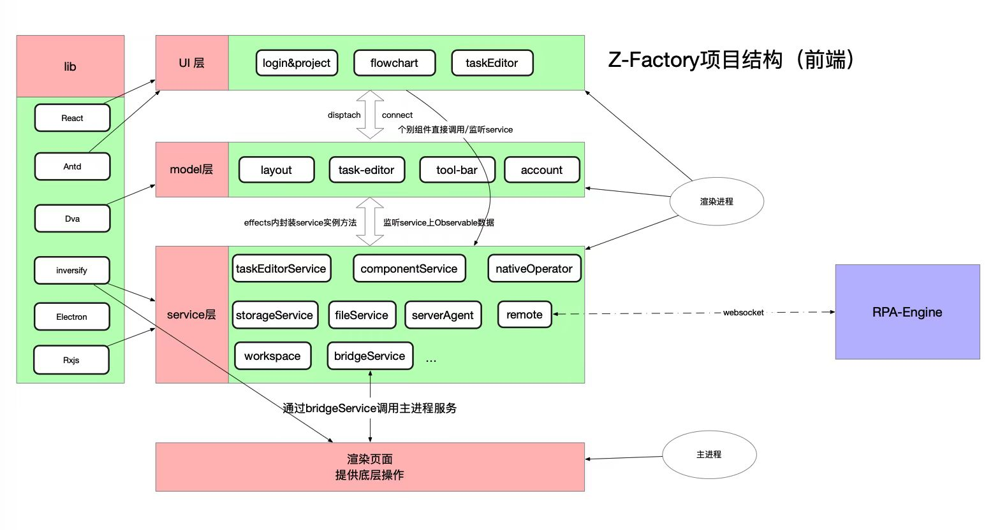

# 机器人流程自动化（RPA）介绍

## - 低代码的另一种应用场景

## 分享者：刘智刚

---

·

# 什么是 RPA

- 概念：机器人`流程`自动化（Robotic process automation，简称 RPA）是通过软件机器人及人工智能（AI）将基础业务进行自动化的一种技术
- 业务形式：通过可视化工具搭建自动化脚本，通过模仿人类操作电脑的步骤，提供了另一种方式来使最终用户手动操作流程自动化

[视频讲解：什么是 RPA](https://www.bilibili.com/video/BV1Wf4y1c7bS?spm_id_from=333.999.0.0)

---

# RPA 适用的场景

- 大量重复
- 有逻辑规则
- 跨应用协同

## 

---

## 跟一般低代码的区别

## 

---

# RPA 工具的演示

---

# RPA 三大件

## 

---

# RPA 客户端整体结构

## 

---

# RPA 设计器前端技术选型

## 选型

> 原则：技术通用，与当前团队匹配，行业内有典型应用方案，文档友好

- React+Dva：团队比较熟悉该技术，需要 Dva 将 UI 与行为解耦，在 Dva 内或通过 Dva 链接其他逻辑
- Electron： 有一点经验基础，有 vscode 作为参考
- 依赖注入： 有一点经验基础，有 vscode 作为参考，适合封装组合模块功能
- Rxjs：需要有一种数据响应机制，能解决，服务与服务的联动，服务层的数据与 UI 的联动， 通过 Redux 不合适

---

# 设计器前端架构设计

## 

---

# 几个重点功能

- 可视化转代码：流程图转代码+内部任务快转代码
- 自建组建：基于原子组建自主搭建的新组建
- 代码转可视化
- 基于 python 注释生产组建描述文件
- 跨进程的插件化
