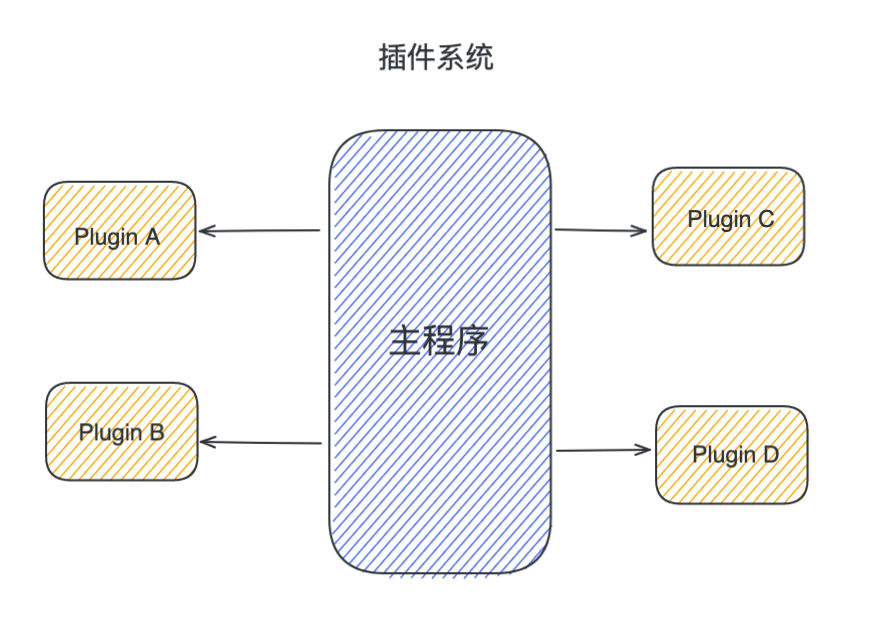
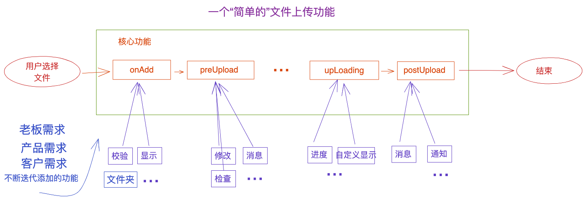
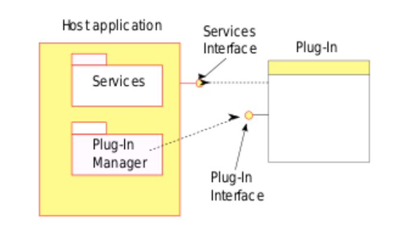
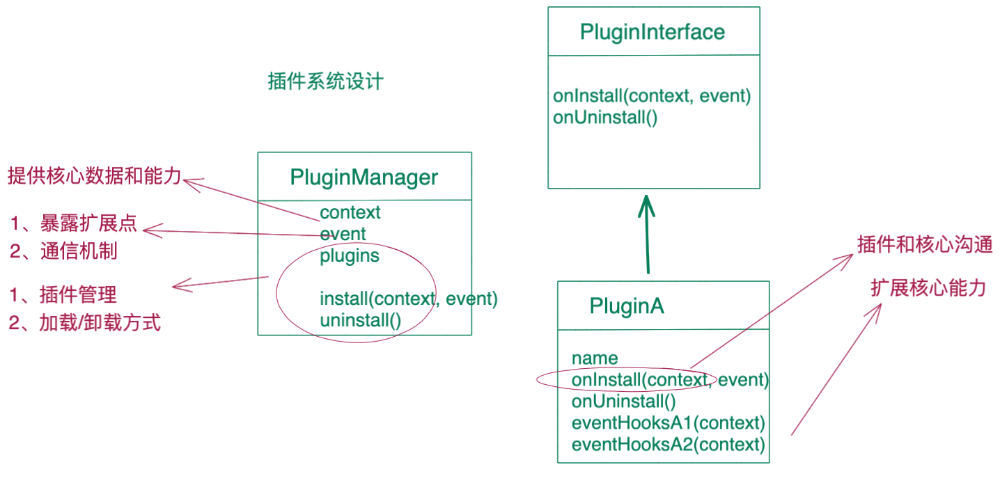

# 插件机制设计-part(1)

By 贾克深

---

## 分享内容

- ### 什么是插件?为什么需要插件机制?
- ### 常见的插件框架举例
- ### 插件设计的几个核心要点
- ### 一个简单的插件机制
- ### 总结

---

## 什么是插件?

## 插件是一个软件组件，可以给已有的软件系统添加特定的功能

##### webpack、vscode、redux、cli 工具

---



---

## 为什么使用插件?

- ### 核心功能不受影响
- ### 扩展性
- ### 维护性

---

# [常见的插件框架举例](https://www.wolai.com/4kDYSyHZhwLwhjywQJS4yc)

---

## 插件机制设计要点

- 插件的管理（提供核心能力，暴露扩展点）
- 插件加载方式（文件形式/主动加载）
- 插件与核心的沟通（核心提高哪些功能, 核心通过什么机制触发插件)
- 插件间的执行与沟通（包括插件间通信、相互间的执行顺序、插件间的依赖）

---

## 一个简单的功能

### 产品提了一个需求：开发一个文件上传功能

上代码

```javascript
// 一个上传文件功能
async function uploadFile() {
  const files = await selectFiles()
  await doUpload(files)
  console("done! nice Job!")
}
```

---

#### 想做一个简简单单的码仔？

# 不可能！！！

---

## 

---

## 来自需求的暴击

## 

---

## 开发的自白

## 

---

## 灵魂拷问

1、如何应对变化，更方便添加新功能（可维护）？
2、如何减少开发新功能导致核心不可用（核心可用）？
3、如何让用户自己添加新功能（可扩展）？

---

## 解决之道

# 插件机制

---

## 

---

## 

---

## Talk is cheap, Show me your code!

[一个基于事件的插件系统演示](https://github.com/woxixiulayin/my-slides/tree/master/plugin-design/example/simplePlugin)

---

## 总结

- #### 产品迭代一直处于变化，开发如何用最小成本解决构建和维护问题
- #### 设计原则：
  - ##### 单一职责
  - ##### 开放封闭
- #### 插件机制要解决的问题
  - ##### 核心功能不受影响
  - ##### 方便扩展
  - ##### 维护性高

---
