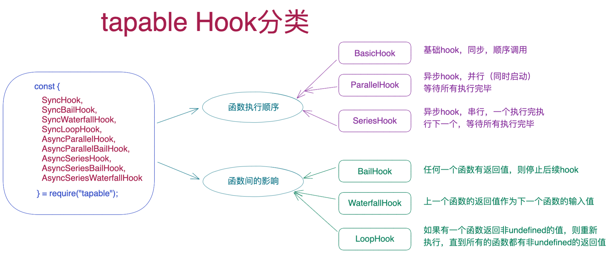
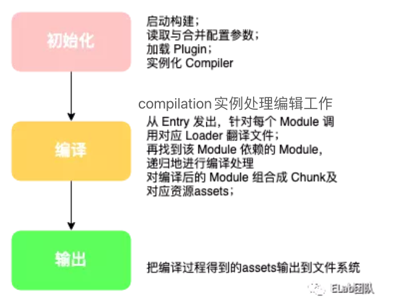

# 插件机制设计-part(2)

### By 贾克深

---

# 回顾

## 上一期实现的插件机制代码，有哪些问题？

### [simplePlugin 代码库](https://github.com/woxixiulayin/my-slides/tree/master/plugin-design/example/simplePlugin)

---

# 问题

### 1、event 无法控制每个回调函数的运行顺序，同步、异步、并行、出错问题

### 2、插件可以随意修改内部 context

### 3、可否沉淀出通用的插件库

---

# webpack 是如何处理的？

## tapable 插件库

### 一个通用的插件库，提供各种勾子函数用于创建勾子提供给插件进行注册回调

---

# 回顾插件设计核心要点

- 插件的管理（插件内部`apply`方式注册插件）
- 插件加载方式（webpack.config.js 配置`plugins`）
- 插件与核心的沟通（tapable `hooks`方式，核心提供`compiler`和`complation`)
- 插件间的执行与沟通(通过不同类型的 hook 控制调用顺序，插件可以注册自己的`hooks`)

---

# 插件机制抽离出可复用的插件库

- 插件的实现主要靠勾子函数与主程序沟通
- 插件库主要提供各种类型的勾子和勾子管理器让开发者设计自己的插件机制

### [webpack的插件库Tapable](https://github.com/webpack/tapable)

### [字节开源的Modern.js中的插件系统](https://modernjs.dev/docs/apis/runtime/plugin/abstruct)

---

# 开发插件库的核心要点

- hook 模型（插件之间的沟通与执行顺序）
- hook 模型管理器（插件的管理）
- 上下文共享机制（核心与插件的交互）

---

# tapable 的插件系统

---

# webpack 流程简介+插件设计要点的联系

---

# webpack 中最重要的两个对象 compiler + compilation

> 注意两个对象内部对 tapable 中对不同类型 hook 的使用

- [compiler](https://github.com/webpack/webpack/blob/main/lib/Compiler.js)
- [compilation](https://github.com/webpack/webpack/blob/main/lib/Compilation.js)

---

# Modern.js 中的插件系统

---

# 如何迁移在 webpack 原理中学到

### 程序如果满足**确定的输入有确定的输出**，类似**管道操作**，数据流过所有逻辑最后输出，可以借鉴 webpack 插件机制，找出关键勾子时机使用不同类型的**hooks**提供给插件。

###

---

# 总结

- 软件设计要解决的问题：分离**业务逻辑**与**控制逻辑**

- 插件机制是**控制逻辑**的一种典型实现，实现了**可复用的控制逻辑**

- 从细节的开发到整体的设计需要尽可能的分离**业务逻辑**与**控制逻辑**

---
