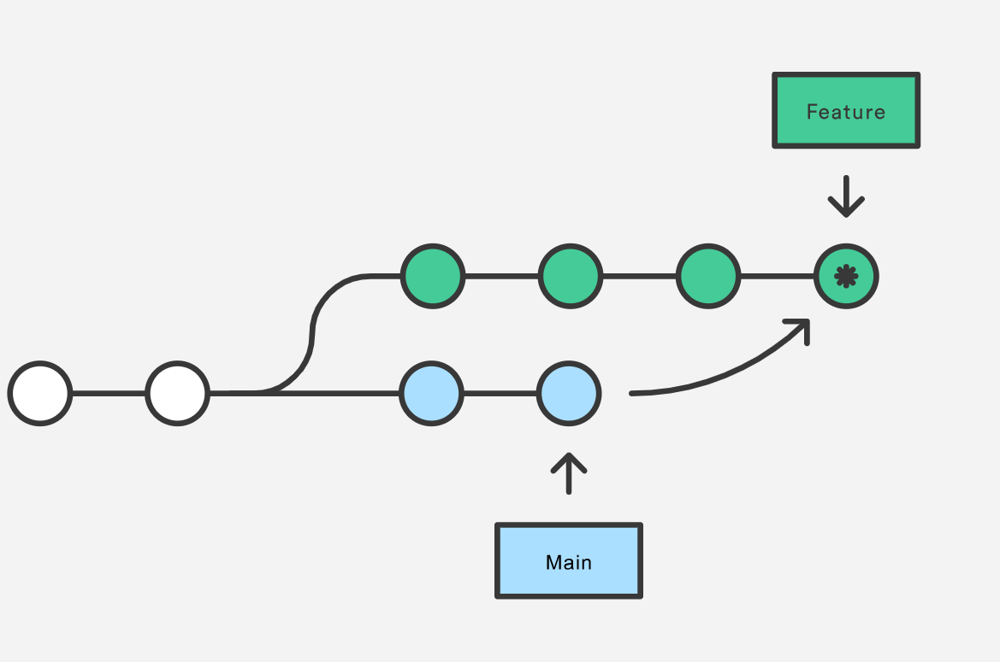

# <!-- fit -->基于 git/gitLab 的版本管理

<!-- footer: by 贾克深 -->

---

# 常见的 git 操作问题

## 

---

# 本次分享的内容

## 从以下 5 个方面介绍常用的 git 开发规范及 gitlab 的一些操作设置

- 常见的 git 操作/流程
- 分支策略
- commit 规范
- 合并规范
- 发版操作

---

# 常见的 git 操作

PS: 本地仓库= .git(所有提交的快照) + 本地文件

## 

---

# 常见的 git 操作问题-回退/撤销

- git revert commitId：新增一笔提交，内容为插撤销对应的修改内容
- git reset --hard commitId：直接将当前分支的 head 指向之前的某一笔提交
- git rebase -i commitId: 针对当前提交到指定提交之间的所有提交重新进行编辑

---

# 常见的 git 操作问题-简写

## 配置文件目录： `~/.gitconfig`

## 

---

# 分支策略

> 需求驱动开发+ 维持固定主线


#### [参考：git flow 开发规范](https://docs.gitlab.com/ee/topics/gitlab_flow.html#introduction-to-gitlab-flow)

---

### 分支策略-分支说明

1.  `master` - 主干分支，长期迭代，稳定分支，需求和 bug-fix 都合入该分支

    > `权限` : 不能删除，不能 push，需要 merge request 合入

2.  `feature-xxx` - 功能开发分支，短期迭代，从 release 分支切出， - 在最后的 merge request 前，需要通过命令 `git rebase 对应分支` 合并 master 分支 - 开发测试后合入 master 分支

    > `权限` ：分支开发完毕后需要删除，可直接 push 代码到该分支

3.  `bugfix-xxx` - 修复分支，短期分支 - 可以通过 merge request 先合入 master 或 release 分支，再 cherry-pick 到需要的分支
    > `权限` ：分支开发完毕后需要删除，可直接 push 代码到该分支

---

### 分支策略-分支说明-只有唯一主线的分支策略

4.  `dev` - 长期开发分支，供开发人员使用，feature 分支从该分支迁出进行开发，解决有固定迭代周期的多需求开发合入问题

    > `权限` ：不能删除，不能 push，feature 分支需要 merge request 合入 dev

5.  `qa` - 测试分支，供测试人员进行功能验证，解决有固定迭代周期的多需求开发合入问题
    > `权限` : 不能删除，不能 push，一般从通过 merge request 合入 dev 分支

---

### 分支策略-分支说明-有定制和版本维护需求的策略

6.  `release-xxx` - 发布分支（可选，针对需要长期维护的特定版本）

    > `权限` ：不能删除，不能 push，需要 merge request 合入，在发版本后打 tag，符合版本号规范，如 **release-5.6.0**

7.  `custom-xxx` - 定制分支（可选，针对特定客户或产品的分支，与 release-xxx 类似，但不具备版本延续性）
    > `权限` : 不能删除，不能 push，需要 merge request 合入，发版后打 tag，符合版本号规范，如 **custom-yancao-5.6.0，**定制分支迭代后需要持续增加版本号

---

## 分支策略-gitlab 分支操作-分支权限

> 设置路径：`项目`-> `Settings` -> `Repository` -> `Protected Branches`
> 对分支进行权限设置,`特定分支名`和`固定开头`的分支设定可以推送/合并的人员


---

# 分支策略-gitlab 分支操作-分支创建

> 设置了权限的分支只能由有权限的人本地或在 web 端创建


---

# commit 规范

## 提交格式

```
<type>(<scope>): <subject>
<BLANK LINE>
<body>
<BLANK LINE>
<footer>
```


#### [参考:Angular 提交信息规范](https://zj-git-guide.readthedocs.io/zh_CN/latest/message/Angular%E6%8F%90%E4%BA%A4%E4%BF%A1%E6%81%AF%E8%A7%84%E8%8C%83/)

---

# commit 规范-实例

```
git commit -m '[feat]: 添加新的功能'
```


---

# commit 规范

> commit 的信息通过特殊约定，实现与缺陷跟踪系统的联动

```
// --story --user --bug等设置与tapd上的信息关联

git commit -m '[feat]: --story=*** --user=***  添加新的功能'
```


---

# 合并规范

> 合并代码的目的：

- 1、解决与远端代码的冲突
- 2、本地代码比远端代码新，即将修改置于远端代码之上（git rebase 可以修改顺序）

---

# 合并规范-本地合并

- git pull = git fetch + `git merge`
- git merge：按提交时间合并两个分支，保留分叉形式，最后一个一笔 merge 提交
  

---

# 合并规范-本地合并

- git rebase: 变基操作，所有提交放在目标分支，没有多余提交
  

---

# 合并规范-本地合并冲突

> 不同开发人员修改同一分文件肯定会存在冲突问题，git 合并中肯定会出现冲突

- 需要在 `git merge` /`git rebase`中手动解决冲突，再进行提交
- 后提交的人需要解决冲突，在解决过程中对代码有疑问的需要与当事人一起 review

---

# 合并规范-merge request

> 通过 merge request 解决乱推代码，并在 review 中提高代码提交质量

## 

---

# 合并规范-CR

> 通过 merge request 解决乱推代码，并在 review 中提高代码提交质量

## 

---

# 发版操作

## 发版：

- 合入 master
- git tag 打标签

## 线上回滚操作

- git checkout tagId

---

# 本次分享总结

- 常见的 git 操作/流程: git fetch/git merge/git push/git rebase/ git revert
- commit 规范: feat: --bug=xxxx --user=xxx 添加新功能(或放入缺陷地址+标题)
- 分支策略： gitlab flow，保留统一分支，设定特定分支权限，通过 feature/bugfix 分支开发
- 合并规范：本地 merge/rebase 操作，提交 merge request 进行合并，在 gitlab 进行 code review
- 发版操作：git tag 打标签

---
